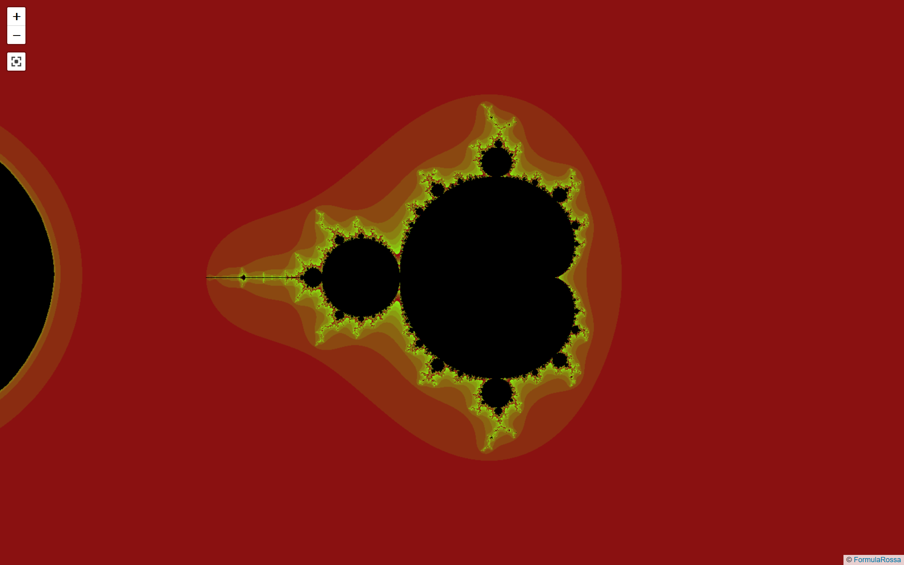
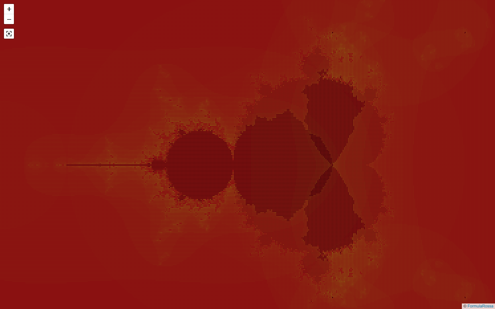
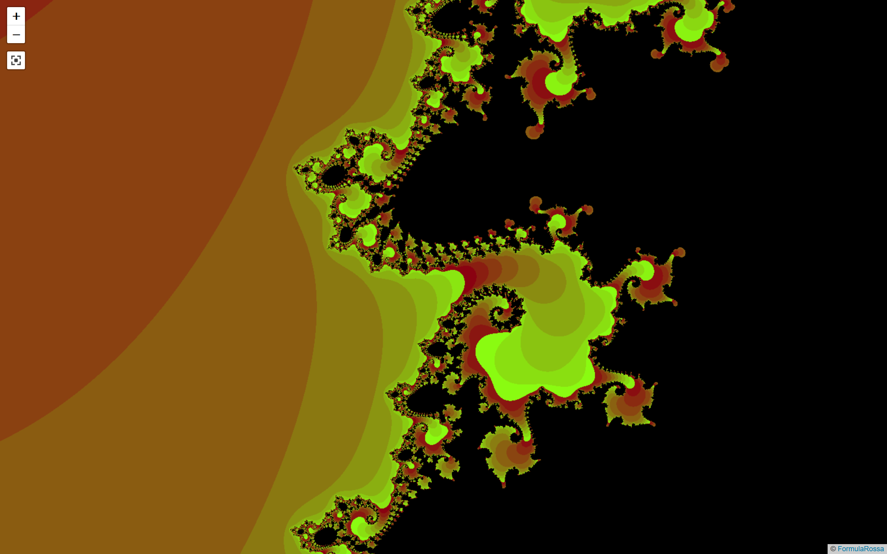

# Mandelbrot set

This program renders the Mandelbrot set on a slippy map in a web browser.

## Screenshots





## Usage

```bash
docker-compose up
```

Then open http://localhost:8080 in a web browser.